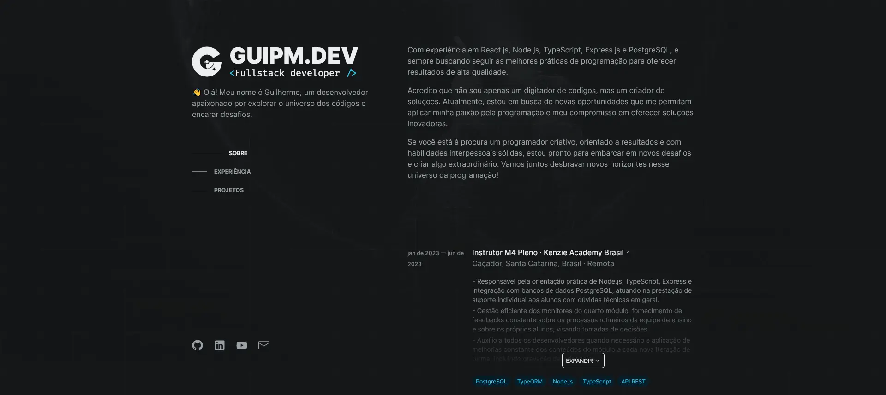
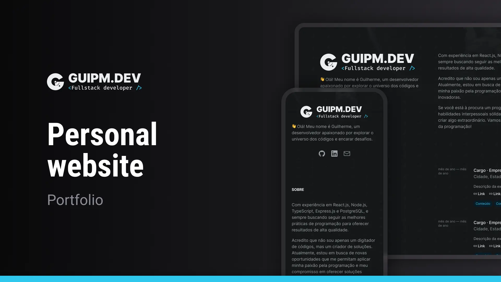

<!-- ===== HEADER ===== -->
<p align="right">
  
  <a href="./README.pt-br.md" title="Ler o README em português brasileiro">
    
  </a>
</p>

<p align="center">
  <a
    href="https://guipm.dev/"
    title="Go to the web application"
  >
    
  </a>
</p>

<h1 align="center">GUIPM.DEV</h1>

<p align="center">
  
  
  
  <a
    href="https://github.com/guipmdev/guipm-dev/commits/main"
    title="View repository commits"
  >
    
  </a>
  <a href="./LICENSE" title="View project license">
    
  </a>
  <a href="https://guipm.dev/" title="Go to the guipm.dev website">
    
  </a>
</p>



<p align="center">
  <a href="https://guipmdev.dev/"
    >Go to the web application ↗</a
  >
</p>

<details>
  <summary>
    <h2>📒 Table of Contents</h2>
  </summary>

- [📍 Overview](#-overview)
  - [⚠️ Disclaimer](#️-disclaimer)
- [✨ Features](#-features)
- [🤖 Demo](#-demo)
- [🎨 Layout](#-layout)
- [🛠 Technologies](#-technologies)
  - [Website](#website)
  - [Server](#server)
  - [Utils](#utils)
- [🚀 Getting Started](#-getting-started)
  - [✔️ Prerequisites](#️-prerequisites)
  - [📦 Installation](#-installation)
  - [⚙️ Usage](#️-usage)
- [📄 License](#-license)
- [👏 Acknowledgments](#-acknowledgments)
</details>

<!-- ===== PROJECT INFOS ===== -->

## 📍 Overview

This project is a web application developed in _Next.js_ and _TypeScript_ for my personal portfolio site. It includes the About, Experience and Project sections, as well as a customized cursor to provide an interactive user experience.

The project connects to an API to fetch the data used on the website, and uses CSS-in-JS to style its components. Overall, it's a visually appealing and interactive platform that showcases the work and experience of its developer.

### ⚠️ Disclaimer

The back-end of this website is built with JSON Server and is not included in this repository. **To test this application on your machine, you'll need to clone both repositories (front and back)**, make the respective configurations and run the scripts, but everything is in detail in the [⚙️ Usage](#️-usage) section!

## ✨ Features

🖱️ **Custom cursor** for a more immersive experience

⚡ **Focus on loading speed**

📱 Made in **mobile first**, meaning great viewing on mobile devices

🌑 **Dark mode always**, to keep your eyes safe

⚙ **Built with SSR**, so even without JavaScript all the information still remains visible

👍 Made with **accessibility and SEO** in mind

## 🤖 Demo

https://github.com/guipmdev/guipm-dev/assets/136738335/135996b2-4aa8-41fc-9aa8-91cd35d3646f

## 🎨 Layout

The layout of the application was designed by **guipm.dev** and is available on [Figma](https://www.figma.com/file/HjCbKGCHj9xffchp1dNpy0/Personal-website).

<p align="center">
  
</p>

## 🛠 Technologies

The following tools were used to build the project:

### Website

<p>
  <a href="https://nextjs.org/">
    
  </a>
  <a href="https://www.typescriptlang.org/">
    
  </a>
  <a href="https://eslint.org/">
    
  </a>
  <a href="https://github.com/rocketseat/eslint-config-rocketseat">
    
  </a>
</p>

<p>
  <a href="https://elbywan.github.io/wretch/">
    
  </a>
  <a href="https://usehooks-ts.com/">
    
  </a>
  <a href="https://sharp.pixelplumbing.com/">
    
  </a>
  <a href="https://vercel.com/">
    
  </a>
</p>

<p>
  <a href="hhttps://panda-css.com/">
    
  </a>
  <a href="https://react-icons.github.io/react-icons/">
    
  </a>
  <a href="https://www.radix-ui.com/">
    
  </a>
</p>

_\* See the [<kbd>package.json</kbd>](./package.json) file_

### Server

<p>
  <a href="https://github.com/typicode/json-server">
    
  </a>
  <a href="https://github.com/typicode/nodemon">
    
  </a>
</p>

### Utils

<p>
  <a href="https://git-scm.com/">
    
  </a>
  <a href="https://nodejs.org/">
    
  </a>
  <a href="https://figma.com/">
    
  </a>
  <a href="https://fonts.google.com/">
    
  </a>
  <a href="https://code.visualstudio.com/">
    
  </a>
</p>

## 🚀 Getting Started

### ✔️ Prerequisites

Before you begin, ensure that you have the following tools installed on your machine: [Git](https://git-scm.com/downloads), [Node.js](https://nodejs.org/en/download). It's also good to have an editor to work with the code, such as [VSCode](https://code.visualstudio.com/Download).

### 📦 Installation

1. Clone the [backend repository](https://github.com/guipmdev/guipm-dev-json-server/):

```sh
git clone https://github.com/guipmdev/guipm-dev-json-server/
```

2. Change to the backend directory:

```sh
cd guipm-dev-json-server
```

3. Install the dependencies:

```sh
npm install
```

4. Go back and clone the project repository:

```sh
cd ..

git clone https://github.com/guipmdev/guipm-dev/
```

5. Change to the project directory:

```sh
cd guipm-dev
```

6. Install the dependencies:

```sh
npm install
```

### ⚙️ Usage

1. Enter the backend directory:

```sh
cd guipm-dev-json-server
```

2. Start the JSON Server:

```sh
npm run dev
```

3. Change to the project directory:

```sh
cd ../guipm-dev
```

4. Rename the file `.env.local.example` to `.env.local` and insert the necessary information:

```sh
mv .env.local.example .env.local
```

5. Run the Panda codegen script:

```sh
npm run prepare
```

6. Start the web application:

```sh
npm run dev
```

7. Access http://localhost:3000/ to view the application

## 📄 License

This project is licensed under the terms of the `MIT` license. See the
[LICENSE](./LICENSE) file for additional info.

## 👏 Acknowledgments

> - Many thanks to [Rocketseat](https://www.rocketseat.com.br/) for the tips I've received so far
> - Credits to the dev [Brittany Chiang](https://brittanychiang.com/) for the site-resume style
> - Credits to the dev [Adenekan Wonderful](https://www.codewonders.dev/) for the cursor style and application background

<!-- ===== FOOTER ===== -->

---

<p align="center">
  Made with 💙 by
  <a href="https://www.guipm.dev/"> @guipm.dev </a>
  - Feel free to
  <a href="mailto:guipm.dev@gmail.com">contact me</a>!
</p>

<br />

<p align="center">
  <a href="#top">
    <b>↑&nbsp;&nbsp; Return to the top &nbsp;&nbsp;↑</b>
  </a>
</p>
