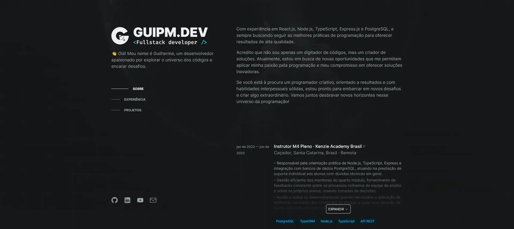
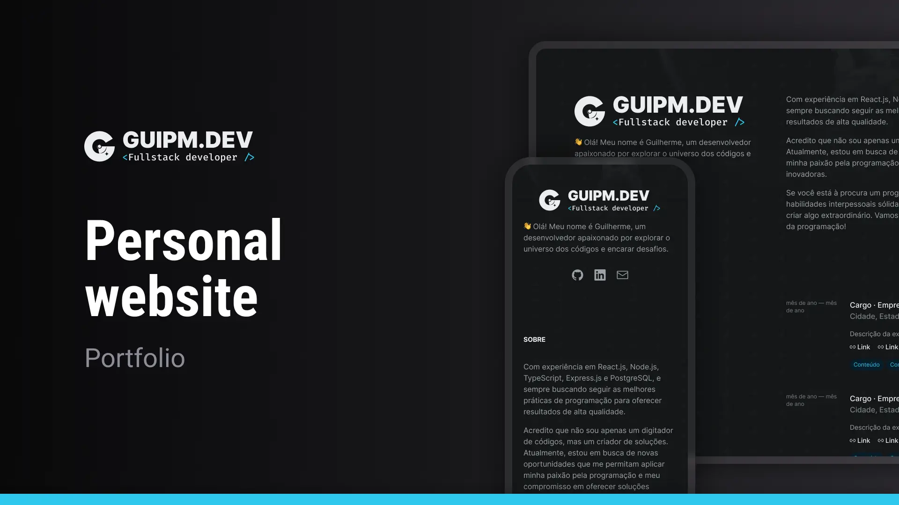

<!-- ===== HEADER ===== -->
<p align="right">
  <a href="./README.md" title="Read the README in english">
    
  </a>
  
</p>

<p align="center">
  <a
    href="https://guipm.dev/"
    title="Acessar a aplicação web"
  >
    
  </a>
</p>

<h1 align="center">GUIPM.DEV</h1>

<p align="center">
  
  
  
  <a
    href="https://github.com/guipmdev/guipm-dev/commits/main"
    title="Visualizar commits do repositório"
  >
    
  </a>
  <a href="./LICENSE" title="Visualizar licença do projeto">
    
  </a>
  <a href="https://guipm.dev/" title="Acessar o site do guipm.dev">
    
  </a>
</p>



<p align="center">
  <a href="https://guipm.dev/"
    >Acessar a aplicação web ↗</a
  >
</p>

<details>
  <summary>
    <h2>📒 Índice</h2>
  </summary>

- [📍 Visão geral](#-visão-geral)
  - [⚠️ Aviso](#️-aviso)
- [✨ Funcionalidades](#-funcionalidades)
- [🤖 Demo](#-demo)
- [🎨 Layout](#-layout)
- [🛠 Tecnologias](#-tecnologias)
  - [Website](#website)
  - [Server](#server)
  - [Úteis](#úteis)
- [🚀 Primeiros passos](#-primeiros-passos)
  - [✔️ Pré-requisitos](#️-pré-requisitos)
  - [📦 Instalação](#-instalação)
  - [⚙️ Utilização](#️-utilização)
- [📄 Licença](#-licença)
- [👏 Reconhecimentos](#-reconhecimentos)
</details>

<!-- ===== PROJECT INFOS ===== -->

## 📍 Visão geral

Esse projeto é uma aplicação web desenvolvida em _Next.js_ e _TypeScript_ para o meu site de portfólio pessoal. Ele inclui as seções Sobre, Experiência, Projeto, além de um Cursor personalizado para proporcionar uma experiência interativa ao usuário.

O projeto se conecta com uma API para buscar os dados usados no website, e usa CSS-in-JS para estilizar os seus componentes. No geral, é uma plataforma visualmente atraente e interativa que mostra o trabalho e a experiência do seu desenvolvedor.

### ⚠️ Aviso

O back-end desse website foi desenvolvido em _JSON Server_ e não está incluso nesse repositório. **Para testar essa aplicação na sua máquina, você precisará clonar ambos os repositórios (front e back)**, fazer as respectivas configurações e executar os scripts, mas tudo está em detalhes na seção de [⚙️ Utilização](#️-utilização)!

## ✨ Funcionalidades

🖱️ **Cursor personalizado** para uma experiência mais imersiva

⚡ **Foco na velocidade** de carregamento

📱 Feito em **mobile first**, ou seja, ótima visualização em dispositivos móveis

🌑 **Dark mode sempre**, para ficar com os olhos tranquilos

⚙ **Construído com SSR**, então mesmo sem JavaScript todas as informações ficam visíveis

👍 Feito pensando em **acessibilidade e SEO**

## 🤖 Demo

https://github.com/guipmdev/guipm-dev/assets/136738335/135996b2-4aa8-41fc-9aa8-91cd35d3646f

## 🎨 Layout

O layout da aplicação foi projetado por **guipm.dev** e está disponível no [Figma](https://www.figma.com/file/HjCbKGCHj9xffchp1dNpy0/Personal-website).

<p align="center">
  
</p>

## 🛠 Tecnologias

As seguintes ferramentas foram usadas para desenvolver esse projeto:

### Website

<p>
  <a href="https://nextjs.org/">
    
  </a>
  <a href="https://www.typescriptlang.org/">
    
  </a>
  <a href="https://eslint.org/">
    
  </a>
  <a href="https://github.com/rocketseat/eslint-config-rocketseat">
    
  </a>
</p>

<p>
  <a href="https://elbywan.github.io/wretch/">
    
  </a>
  <a href="https://usehooks-ts.com/">
    
  </a>
  <a href="https://sharp.pixelplumbing.com/">
    
  </a>
  <a href="https://vercel.com/">
    
  </a>
</p>

<p>
  <a href="hhttps://panda-css.com/">
    
  </a>
  <a href="https://react-icons.github.io/react-icons/">
    
  </a>
  <a href="https://www.radix-ui.com/">
    
  </a>
</p>

_\* Confira o arquivo [<kbd>package.json</kbd>](./package.json)_

### Servidor

<p>
  <a href="https://github.com/typicode/json-server">
    
  </a>
  <a href="https://github.com/typicode/nodemon">
    
  </a>
</p>

### Úteis

<p>
  <a href="https://git-scm.com/">
    
  </a>
  <a href="https://nodejs.org/">
    
  </a>
  <a href="https://figma.com/">
    
  </a>
  <a href="https://fonts.google.com/">
    
  </a>
  <a href="https://code.visualstudio.com/">
    
  </a>
</p>

## 🚀 Primeiros passos

### ✔️ Pré-requisitos

Antes de você começar, certifique-se que você tem as seguintes ferramentas instaladas na sua máquina: [Git](https://git-scm.com/downloads), [Node.js](https://nodejs.org/en/download). Também é bom ter um editor para trabalhar com o código, como o [VSCode](https://code.visualstudio.com/Download).

### 📦 Instalação

1. Clone o [repositório do backend](https://github.com/guipmdev/guipm-dev-json-server/):

```sh
git clone https://github.com/guipmdev/guipm-dev-json-server/
```

2. Mude para o diretório do backend:

```sh
cd guipm-dev-json-server
```

3. Instale as dependências:

```sh
npm install
```

4. Volte e clone o repositório do projeto:

```sh
cd ..

git clone https://github.com/guipmdev/guipm-dev/
```

5. Mude para o diretório do projeto:

```sh
cd guipm-dev
```

6. Instale as dependências:

```sh
npm install
```

### ⚙️ Utilização

1. Entre no diretório do backend:

```sh
cd guipm-dev-json-server
```

2. Inicie o JSON Server:

```sh
npm run dev
```

3. Mude para o diretório do projeto:

```sh
cd ../guipm-dev
```

4. Renomeie o arquivo `.env.local.example` para `.env.local` e insira as informações necessárias:

```sh
mv .env.local.example .env.local
```

1. Execute o script de codegen do Panda:

```sh
npm run prepare
```

6. Inicie a aplicação web:

```sh
npm run dev
```

7. Acesse http://localhost:3000/ para visualizar a aplicação

## 📄 Licença

Este projeto está licenciado de acordo com os termos da licença `MIT`. Consulte o arquivo [LICENSE](./LICENSE) para mais informações.

## 👏 Reconhecimentos

> - Muito obrigado à [Rocketseat](https://www.rocketseat.com.br/) pelas dicas que recebi até aqui
> - Créditos à dev [Brittany Chiang](https://brittanychiang.com/) pelo estilo de site-currículo
> - Créditos ao dev [Adenekan Wonderful](https://www.codewonders.dev/) pelo estilo de cursor e background da aplicação

<!-- ===== FOOTER ===== -->

---

<p align="center">
  Feito com 💙 por
  <a href="https://www.guipm.dev/"> @guipm.dev </a>
  - Fique à vontade para
  <a href="mailto:guipm.dev@gmail.com">entrar em contato comigo</a>!
</p>

<br />

<p align="center">
  <a href="#top">
    <b>↑&nbsp;&nbsp; Voltar ao topo &nbsp;&nbsp;↑</b>
  </a>
</p>
